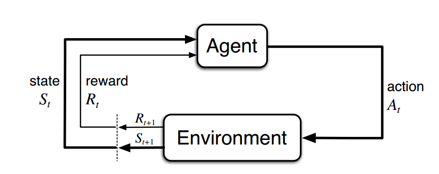
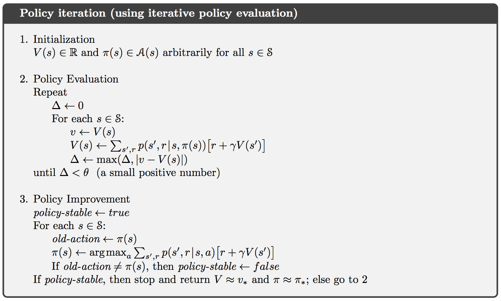
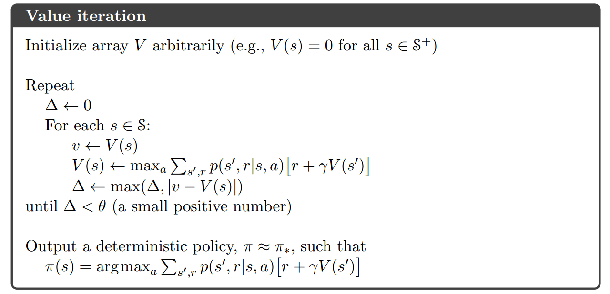
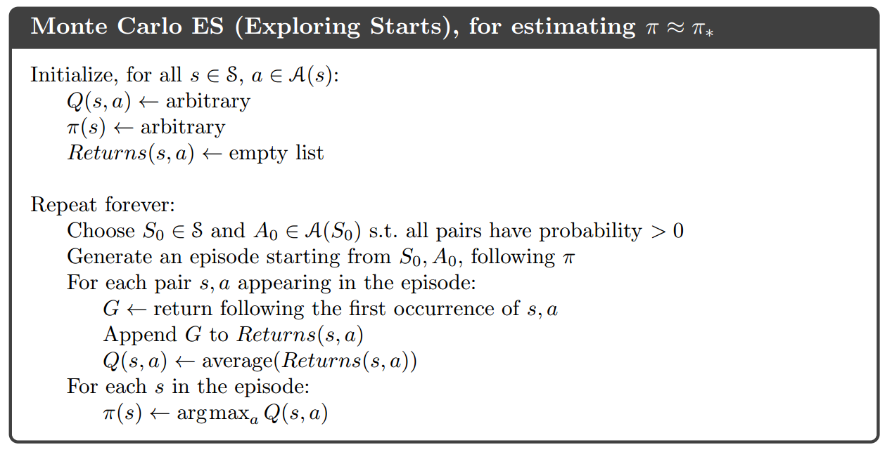
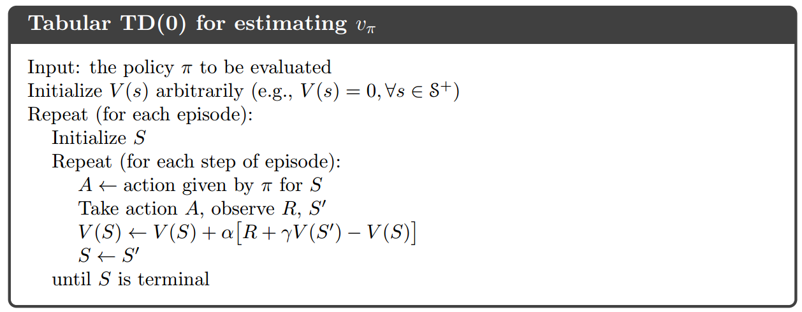
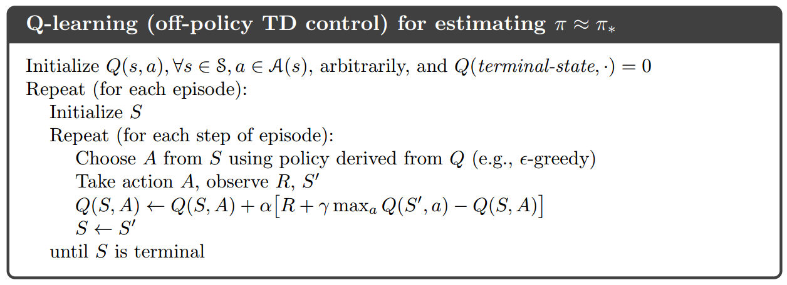
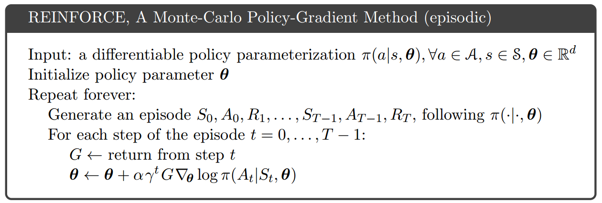
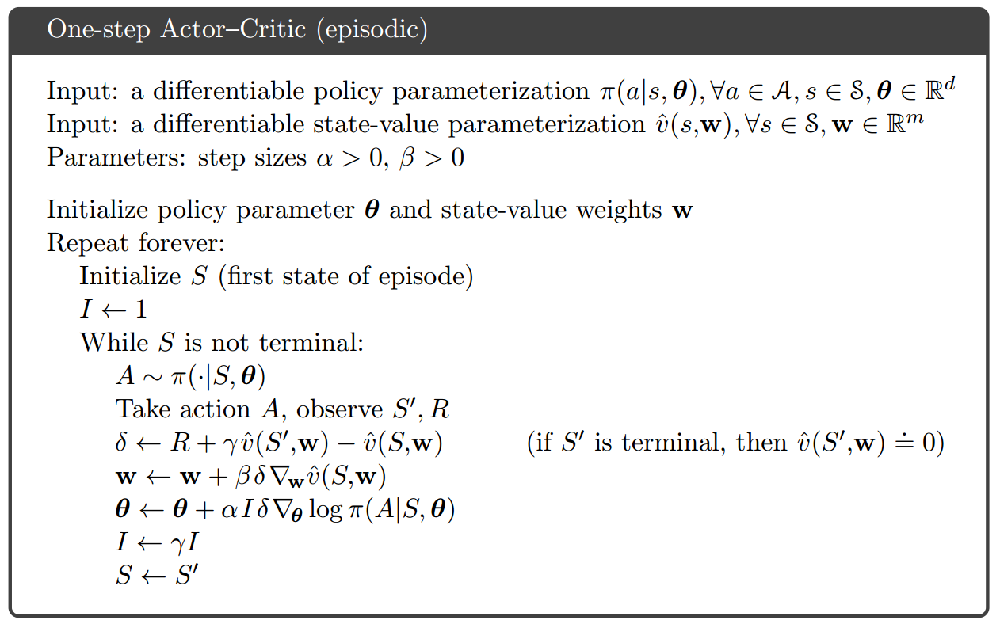

 1.&nbsp;定义和特点
============================

>	- 强化学习(Reinforcement Learning)解决的是代理(Agent)在未知环境(Environment)中通过交互(Interaction)进行学习的方法。不同于监督学习和无监督学习，属于第三种机器学习范式。(By Richard Sutton)
>	- 没有样本标签，只有行动的奖励信号。
>	- 最终反馈结果的获得是延迟的。
>	- 主要针对有前后关系的序列数据，无独立同分布假设。
>	- 当前行为会影响后续收到的回报值大小。

2.&nbsp;四个基本组件
============================

- **策略(Policy)**: 当前Agent所处状态到下一步采取行动的映射，是强化学习的学习目标。

- **回报(Reward)**: 衡量Agent采取的行动的好坏的值。

- **状态值函数(Value Function)**: 从当前状态开始获得的预期长期累计回报，代表对当前状态价值高低的估计。

- **环境模型(Model)**: 对当前环境中各个变量变化情况的建模表示。典型的是离散变量下的概率分布模型。

3.&nbsp;四个重要概念
============================

- **Agent**: 学习在未知环境中做决策的对象。例如棋类游戏中的棋子。

- **Environment**: Agent的交互对象，针对Agent的行动，给出回报及下一步的状态。

- **Policy**: $\pi_{t}(a_{t}|s_{t})$

- **长期累积回报**: $G_{t}=R_{t+1}+\gamma R_{t+2}+\gamma^{2}R_{t+3}+\cdots=\sum\limits_{k=0}^{n}\gamma^{k}R_{t+k+1}$, $\gamma$ 是折扣因子。Agent的目标就是通过与环境的不断交互，学习最优的策略，从而最大化长期累计回报。

4.&nbsp;MDP(Markov Decision Process)
===========================

- MDP描述了一种用概率分布建模的环境，环境中的状态转移具有马尔科夫性，即**下一时刻的状态只与当前状态s和采取的动作a有关，而与之前的状态和动作无关**。针对强化学习要解决的环境交互式学习任务，往往简化其环境是MDP，方便求解。

$$P(S_{t+1}=s', R_{t+1}=r|S_{0},A_{0},R_{1},...,S_{t},A_{t})=P(S_{t+1}=s', R_{t+1}|S_{t}=s,A_{t}=a)$$

5.&nbsp;状态值函数，动作价值函数与Bellamn方程
=============================

> - $v_{\pi}(s) = E_{\pi}[G_{t}|S_{t}=s]=E_{\pi}[\sum\limits_{k=0}^{n}\gamma^{k}R_{t+k+1}|S_{t}=s]$

> - $q_{\pi}(s, a) = E_{\pi}[G_{t}|S_{t}=s, A_{t}=a]=E_{\pi}[\sum\limits_{k=0}^{n}\gamma^{k}R_{t+k+1}|S_{t}=s,A_{t}=a]$

> - Bellman方程: $v_{\pi}(s) = \sum\limits_{a}\pi(a|s)\sum\limits_{s', r}p(s',r|s,a)[r+\gamma v_{\pi}(s')]$ <--> 状态值函数递归求解方程

> - 最优值函数: $v_{\star}(s) = \max\limits_{\pi}v_{\pi}(s) \Rightarrow v_{\star}(s)=\max\limits_{a \in A(s)}=\sum\limits_{s', r}p(s',r|s,a)[r+\gamma v_{\star}(s')]$

> - 最优动作价值函数: $q_{\star}(s, a) = \max\limits_{\pi}q_{\pi}(s, a) \Rightarrow q_{\star}(s, a)=\sum\limits_{s', r}p(s', r|s,a)[r + \gamma \max\limits_{a'}q_{\star}(s', a')]$

> - 动作价值函数在求解最优策略时更加直接，所以更加常用。

6.&nbsp;依赖模型的最优策略函数计算：策略迭代与值迭代
==============================

> **策略迭代: 包含策略评估和策略提升两个部分。**

> **值迭代: 直接迭代计算状态值函数。**

> **策略迭代和值迭代都是一种动态规划的思路，都需要事先知道环境的具体MDP模型，但实际情况中很难预先估计。**

7.&nbsp;模型无关的值函数计算: Monte-Carlo和Temporal-Difference
============================

- 模型无关的值函数估计方法不需要事先知道环境的具体模型，主要通过与环境交互过程中产生的实际经验${s_{t},a_{t},r_{t+1},s_{t+1},a_{t+1},r_{t+2},...,s_{T},a_{T},r_{T+1}}$来直接估计值函数。

> Monte-Carlo方法: 使用完整经验片段(episode)中最终回报的平均值来估计值函数。

> Temporal-Difference方法: 从不完整的经验片段中估计值函数。

> Q-Learning: TD方法的一种，直接估计动作价值Q函数。

8.&nbsp;近似求解方案
============================

> - 前面的强化学习算法一般是将(s,a)存在一张表中，在状态空间或动作空间很大时，耗费内存空间并且泛化能力差，使用函数来近似值函数或动作价值函数可以避免这些问题。即$v_{\pi}(s) \approx \hat{v}(s,w)或q_{\pi}(s)=\hat{q}(s,a,w)$，这里w是函数的参数。

> - 常见的近似函数优线性函数和神经网络。线性函数往往需要精心构造表示状态的特征，而神经网络可以直接接受原始输入。

> - Deepmind开发的玩Atari游戏的DQN和围棋程序Alphago的策略网络都使用了卷积神经网络来近似值函数或动作价值函数，展现了优异的结果。

9.&nbsp;策略梯度方法
============================

> 直接近似策略函数: $\pi\{a|s,\theta\}=p(A_{t}=a|S_{t}=s,\theta_{t}=\theta)$。直接根据状态计算出最终的动作值.

- REINFORCE方法: 根据策略函数梯度更新参数值。

- Actor-Critic方法: 结合使用值函数近似和策略函数近似。值函数作为critic来知道策略函数的训练。

10.&nbsp;强化学习的应用
======================

- 游戏AI: 视频游戏(Atari、星际争霸)，棋类游戏(围棋)
- Web服务: 新闻(Yahoo!)、广告、商品个性化推荐(Alibaba)
- 机器人控制
- 聊天机器人

11.&nbsp;参考资料
=======================

[1][Reinforcement Learning Lecture by David Silver](http://www0.cs.ucl.ac.uk/staff/d.silver/web/Teaching.html) 
[2][CS 294: Deep Reinforcement Learning by UC Berkeley](http://rll.berkeley.edu/deeprlcourse/) 
[3][强化学习by莫凡](https://morvanzhou.github.io/tutorials/machine-learning/reinforcement-learning/) 
[4][Reinforcement Learning: An Introduction (2nd Edition) by Richar Sutton](http://incompleteideas.net/sutton/book/the-book-2nd.html) 
[5] https://github.com/ShangtongZhang/reinforcement-learning-an-introduction 
[6][OpenAI Gym](https://gym.openai.com/)(比较不同强化学习算法的软件环境平台，包含很多游戏环境) 
[7][Deepmind Rearch Blog](https://deepmind.com/research/publications/) 
[8][Deep Reinforcement Learning: An Overview by Yuxi Li](https://arxiv.org/abs/1701.07274)
